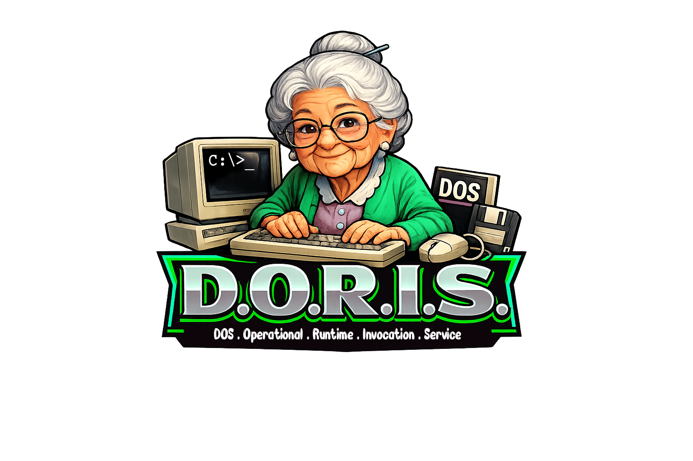

  

# D.O.R.I.S.

## Disk Operating system Replacement Interface System

**Version 2.1 --- "Classic DOS Reborn"**

A reproducible, self-healing DOS desktop environment for modern Debian
systems.

D.O.R.I.S. treats DOS applications as discrete runtime invocations
rather than as a single persistent emulator session.

------------------------------------------------------------------------

# Overview

D.O.R.I.S. provisions a minimal, deterministic stack built around:

-   XLibre (automatic fallback to xserver-xorg)
-   i3 window manager
-   dosemu2 (KVM-accelerated where available)
-   Structured FreeDOS-backed C: drive
-   Shared D: workspace
-   CLI and desktop launcher tooling
-   Autologin → startx → i3 boot flow
-   Self-healing installer phases

The objective is controlled legacy execution with minimal surface area.

------------------------------------------------------------------------

# Architectural Model

D.O.R.I.S. is not simply "running DOS in a window."

It is:

-   A dedicated X11 display stack
-   A deterministic window manager configuration
-   A structured dosemu2 runtime
-   A process-isolated invocation model

Each launched DOS application:

-   Executes in its own dosemu2 process
-   Mounts a shared D: drive
-   Uses a structured C: drive
-   Is isolated at the Linux process level
-   Can be launched via CLI or .desktop shortcut

You are invoking runtime instances, not entering a monolithic DOS
session.

------------------------------------------------------------------------

# Boot Flow

tty1\
→ autologin\
→ startx\
→ XLibre\
→ i3\
→ PCManFM

No display manager.\
No compositor.

Minimal stack. Deterministic behavior.

------------------------------------------------------------------------

# Installer Design (Self-Healing)

The installer is phase-based and idempotent.

Phases:

1.  Base packages\
2.  X server configuration\
3.  i3 environment\
4.  dosemu2 (apt → backports → source fallback)\
5.  Directory structure\
6.  FreeDOS base system\
7.  Games & utilities\
8.  dosemu2 configuration\
9.  CLI tooling\
10. i3 configuration\
11. X session configuration\
12. Autologin setup\
13. Desktop integration\
14. Verification

The script may be safely re-run at any time to repair or complete
installation.

------------------------------------------------------------------------

# DOS Environment Structure

\~/dos_env/

drive_c/\
BIN/\
SYS/\
DOS/\
TEMP/\
HELP/

drive_d/\
APPS/\
GAMES/\
UTILS/\
WORK/\
DOCS/

freedos_cache/

D: is shared across runtime instances.\
C: is structured and reproducible.

------------------------------------------------------------------------

# Emulator Layer

dosemu2

Installation priority:

1.  apt\
2.  Debian backports\
3.  Source build (automatic fallback)

KVM acceleration is enabled if available.

------------------------------------------------------------------------

# FreeDOS Provisioning

FreeDOS 1.4 base packages are retrieved from:

-   Official FreeDOS repository\
-   Kernel releases from GitHub\
-   FullUSB fallback image if repository access fails

If no external kernel is available, the built-in dosemu2 kernel is used.

------------------------------------------------------------------------

# Command Surface

All commands are installed to `/bin`.

------------------------------------------------------------------------

## `doris` --- Main Entry

doris dos\
doris run APP.EXE\
doris apps\
doris scan\
doris update\
doris power

------------------------------------------------------------------------

## `doris-apps`

Interactive downloader for selected archival titles:

-   Prince of Persia\
-   Doom (Shareware)\
-   Wolfenstein 3D\
-   Commander Keen 4

Handles extraction, permissions, and post-install scanning
automatically.

------------------------------------------------------------------------

## `doris-scan`

Scans D: drive for:

-   .exe\
-   .com

Filters out common installer and setup binaries.

Automatically generates trusted desktop launchers.

------------------------------------------------------------------------

## `doris-run`

Direct execution wrapper:

doris-run D:`\GAMES`{=tex}`\DOOM`{=tex}`\DOOM`{=tex}.EXE "Doom"

Launches isolated dosemu window with custom title.

------------------------------------------------------------------------

## `doris-update`

FreeDOS package management wrapper:

doris-update all\
doris-update kernel\
doris-update install edit\
doris-update list

------------------------------------------------------------------------

## `doris-power`

Graphical (Zenity) or CLI power control:

-   Shutdown\
-   Reboot\
-   Logout\
-   Lock

Passwordless execution is restricted to the sudo group.

------------------------------------------------------------------------

# Display Stack Philosophy

Primary:

XLibre

Fallback:

xserver-xorg

Intentionally excluded:

-   Wayland\
-   XWayland\
-   GNOME\
-   KDE\
-   Mutter\
-   Weston

The goal is compatibility and determinism for legacy software.

------------------------------------------------------------------------

# Logging & State

Install log:

/var/log/doris-install.log

State tracking:

/var/lib/doris-install.state

Each completed phase is recorded for repeatable execution.

------------------------------------------------------------------------

# Current Limitations

Not enabled by default:

-   SoundBlaster emulation\
-   MIDI routing\
-   Network stack inside DOS\
-   Per-application resource tuning\
-   Snapshot/rollback per runtime\
-   Wayland support\
-   Multi-seat isolation

COM detection is extension-based by design.

------------------------------------------------------------------------

# Intended Use Cases

-   Legacy engineering tools\
-   Retro development (Turbo C, Pascal)\
-   Archival software access\
-   Controlled DOS experimentation\
-   Lab deployments\
-   Minimalist retro workstation builds

------------------------------------------------------------------------

# Philosophy

Modern Linux stacks are complex.\
Legacy stacks are fragile.

D.O.R.I.S. narrows the system to:

-   One display server\
-   One window manager\
-   One emulator\
-   One structured drive model\
-   One command surface

Minimal moving parts.\
Deterministic behavior.\
Repeatable deployment.

And yes --- it runs 30‑year‑old binaries on modern hardware cleanly.
